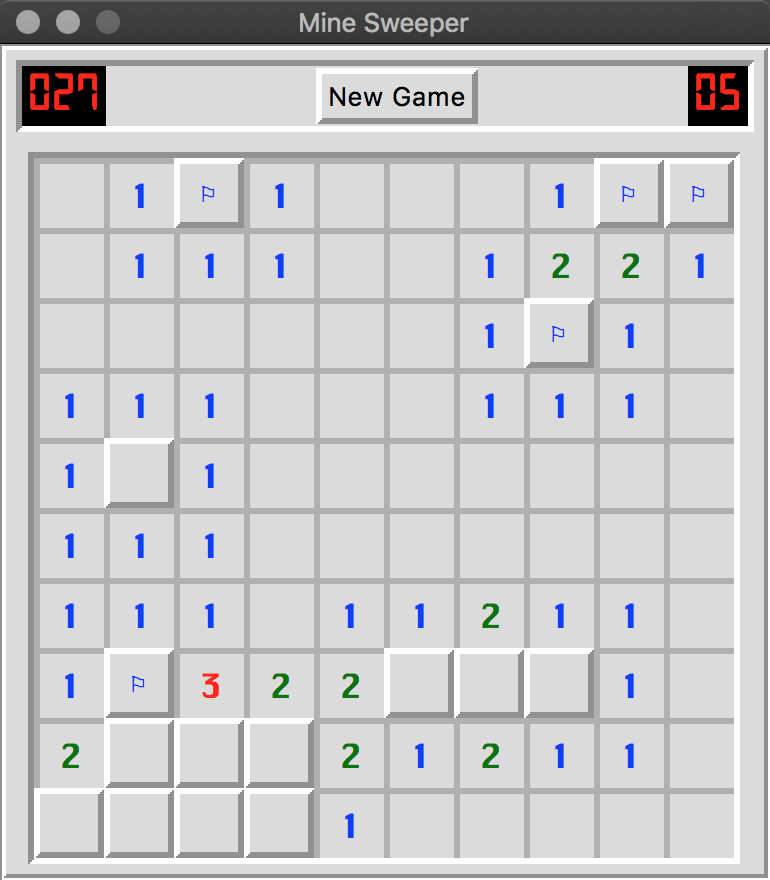

# mine-sweeper

This program is mine sweeper with python3. I used GUI library as tkinter.

I recommend using krungthep font ([here](http://fonts3.com/fonts/k/Krungthep.html "donwload page")).

## Features
- [x] can change row, column and the number of the bombs
- [x] looks like windows mine sweeper

## License
MIT